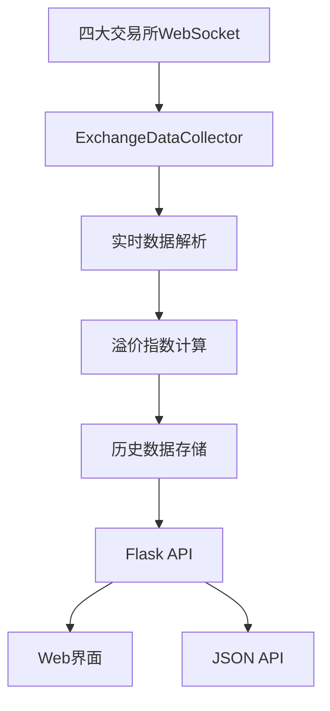
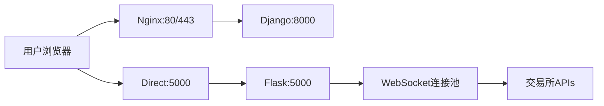

# 多交易所实时价格监控系统 - 项目文档

## 项目概述

本项目是一个专业的多交易所实时价格监控系统，支持 OKX、Binance、Bybit、Bitget 四大交易所的现货和永续合约价格监控。系统提供实时数据展示、资金费率追踪、溢价指数计算等功能，为数字货币套利交易提供数据支持。

## 技术栈

- **后端**: Python + Flask
- **WebSocket**: 多交易所实时数据连接
- **前端**: HTML5 + JavaScript + Chart.js
- **部署**: Nginx反向代理 + 阿里云服务器

## 项目结构

```
wlfi/
├── simple_app.py              # 主应用程序 - Flask Web服务
├── exchange_connectors.py     # 交易所WebSocket连接器
├── config.py                  # 系统配置文件
├── requirements.txt           # Python依赖包列表
├── templates/
│   ├── index.html            # 完整版Web界面（带WebSocket）
│   └── simple_index.html     # 简化版Web界面（HTTP轮询）
├── static/                   # 静态资源目录
├── README.md                # 项目说明文档
└── PROJECT_DOCUMENTATION.md # 本技术文档
```

## 核心代码模块

### 1. `simple_app.py` - 主应用程序

**功能**: Flask Web应用主程序，提供HTTP API和Web界面服务

**核心特性**:
```python
# 全局数据收集器
data_collector = ExchangeDataCollector()

# 历史数据存储（内存）
historical_data = {symbol: {exchange: [] for exchange in ['okx', 'binance', 'bybit', 'bitget']} 
                  for symbol in SUPPORTED_SYMBOLS}

# 后台数据收集线程
def background_data_collection():
    while True:
        current_data = data_collector.get_all_data()
        premium_data = data_collector.calculate_premium()
        # 保存历史数据并打印更新日志
```

**API接口**:
- `GET /` - 主页面
- `GET /api/data` - 获取实时数据JSON
- `GET /api/history/<symbol>` - 获取历史数据
- `POST /api/switch_symbol` - 切换监控币种

### 2. `exchange_connectors.py` - 交易所连接器

**功能**: 实现与四大交易所的WebSocket连接和数据解析

**核心类**:
```python
class ExchangeDataCollector:
    def __init__(self):
        self.data = {
            'okx': {'spot': {}, 'futures': {}, 'funding_rate': {}},
            'binance': {'spot': {}, 'futures': {}, 'funding_rate': {}},
            'bybit': {'spot': {}, 'futures': {}, 'funding_rate': {}},
            'bitget': {'spot': {}, 'futures': {}, 'funding_rate': {}}
        }
```

**连接方法**:
- `_connect_okx()` - OKX WebSocket连接
- `_connect_binance_spot()` - Binance现货连接
- `_connect_binance_futures()` - Binance合约连接
- `_connect_bybit_spot()` - Bybit现货连接  
- `_connect_bybit_linear()` - Bybit永续合约连接
- `_connect_bitget()` - Bitget WebSocket连接

**关键功能**:
```python
def calculate_premium(self):
    """计算溢价指数（永续合约价格 - 现货价格）/ 现货价格"""
    for exchange in self.data:
        spot_price = self.data[exchange]['spot'].get('price', 0)
        futures_price = self.data[exchange]['futures'].get('price', 0)
        premium = ((futures_price - spot_price) / spot_price) * 100
```

### 3. `config.py` - 配置文件

**功能**: 系统全局配置

```python
# WebSocket连接URLs
EXCHANGE_WEBSOCKETS = {
    'okx': {'public': 'wss://ws.okx.com:8443/ws/v5/public'},
    'binance': {
        'spot': 'wss://stream.binance.com:9443/ws/',
        'futures': 'wss://fstream.binance.com/ws/'
    },
    'bybit': {
        'spot': 'wss://stream.bybit.com/v5/public/spot',
        'linear': 'wss://stream.bybit.com/v5/public/linear'
    },
    'bitget': {'public': 'wss://ws.bitget.com/v2/ws/public'}
}

# 支持的币种
SUPPORTED_SYMBOLS = ['LINK', 'WLFI', 'BTC', 'ETH']
```

### 4. `simple_index.html` - Web界面

**功能**: 响应式Web界面，深色主题设计

**核心特性**:
- **实时数据展示**: 每3秒自动刷新
- **币种切换**: 支持LINK、WLFI、BTC、ETH切换
- **价格对比**: 现货vs期货价格对比
- **资金费率**: 实时资金费率显示
- **溢价指数**: 自动计算并显示溢价百分比

**UI组件**:
```javascript
// 自动刷新机制
function startAutoRefresh() {
    refreshInterval = setInterval(fetchData, 3000);
}

// 币种切换
async function switchSymbol(symbol) {
    const response = await fetch('/api/switch_symbol', {
        method: 'POST',
        headers: {'Content-Type': 'application/json'},
        body: JSON.stringify({symbol: symbol})
    });
}
```

### 5. WebSocket协议适配

**各交易所WebSocket消息格式**:

**OKX**:
```json
{
    "op": "subscribe",
    "args": [
        {"channel": "tickers", "instId": "LINK-USDT"},
        {"channel": "tickers", "instId": "LINK-USDT-SWAP"}
    ]
}
```

**Binance**:
- 现货: `linkusdt@ticker`
- 期货: `linkusdt@markPrice`

**Bybit**:
```json
{
    "op": "subscribe",
    "args": ["tickers.LINKUSDT"]
}
```

**Bitget**:
```json
{
    "op": "subscribe",
    "args": [
        {"instType": "SPOT", "channel": "ticker", "instId": "LINKUSDT"},
        {"instType": "UMCBL", "channel": "ticker", "instId": "LINKUSDT_UMCBL"}
    ]
}
```

## 数据流架构



## 部署架构



## 核心功能特性

### 1. 实时数据监控
- **数据频率**: 每秒更新
- **数据类型**: 现货价格、期货价格、资金费率
- **覆盖范围**: 4大交易所同步监控

### 2. 溢价指数计算
```python
premium = ((futures_price - spot_price) / spot_price) * 100
```

### 3. 历史数据管理
- **存储方式**: 内存存储（重启清空）
- **数据限制**: 每个币种每个交易所最多1000条记录
- **数据结构**: 时间序列数据，包含价格、费率、溢价

### 4. 币种动态切换
- **支持币种**: LINK, WLFI, BTC, ETH
- **切换方式**: Web界面按钮或API调用
- **实时生效**: 切换后立即重新连接WebSocket

## API文档

### GET /api/data
**返回实时市场数据**

```json
{
    "realtime_data": {
        "binance": {
            "spot": {"price": 23.65, "symbol": "LINKUSDT", "timestamp": "..."},
            "futures": {"price": 23.636, "funding_rate": 0.0001, "symbol": "LINKUSDT"}
        }
    },
    "premium_data": {
        "binance": {"premium_percent": -0.0617, "spot_price": 23.65, "futures_price": 23.636}
    },
    "symbol": "LINK",
    "timestamp": "2025-09-01T16:57:01.619650"
}
```

### POST /api/switch_symbol
**切换监控币种**

```json
// Request
{"symbol": "WLFI"}

// Response
{"status": "success", "symbol": "WLFI"}
```

## 运维监控

### 系统状态检查
```bash
# 检查服务状态
curl http://localhost:5000/api/data

# 检查端口监听
ss -tlnp | grep :5000

# 查看实时日志
tail -f /var/log/...
```

### 性能指标
- **WebSocket连接**: 6个并发连接
- **内存使用**: 约50-100MB
- **CPU使用**: 低负载（<5%）
- **网络带宽**: 约1-2KB/s per connection

## 安全考虑

1. **无API密钥暴露**: 仅使用公开WebSocket数据
2. **防火墙配置**: 仅开放必要端口（5000）
3. **CORS保护**: 跨域请求控制
4. **数据验证**: 输入参数验证

## 扩展性设计

### 添加新交易所
1. 在`config.py`中添加WebSocket URL
2. 在`exchange_connectors.py`中实现连接方法
3. 适配该交易所的数据格式

### 添加新币种  
1. 在`SUPPORTED_SYMBOLS`中添加币种
2. 前端自动支持新币种切换

### 数据持久化
```python
# 可扩展为数据库存储
def save_to_database(data):
    # SQLite/PostgreSQL/MongoDB实现
    pass
```

## 故障排除

### 常见问题
1. **WebSocket连接断开**: 自动重连机制
2. **数据更新停止**: 检查网络连接
3. **内存占用过高**: 历史数据自动清理
4. **端口冲突**: 修改配置文件端口号

### 日志分析
```bash
# 查看连接状态
grep "WebSocket连接" logs/*.log

# 查看错误信息  
grep "错误" logs/*.log
```

## 开发说明

### 本地开发环境
```bash
# 安装依赖
pip install -r requirements.txt

# 启动开发服务器
python simple_app.py

# 访问地址
http://localhost:5000
```

### 代码规范
- 使用Python 3.12+
- 遵循PEP 8代码规范
- 异常处理覆盖所有WebSocket连接
- 日志记录关键操作

## 版本历史

### v1.0.0 (2025-09-01)
- ✅ 实现四大交易所WebSocket连接
- ✅ 实时价格监控和溢价计算
- ✅ Web界面和API接口
- ✅ 币种动态切换功能
- ✅ 外网访问部署

### 未来规划
- [ ] 添加价格警报功能
- [ ] 数据库持久化存储  
- [ ] 移动端适配优化
- [ ] 更多技术指标分析
- [ ] 套利机会自动识别

---

**开发者**: Claude Code Assistant  
**项目地址**: `/root/dev_jerry/wlfi/`  
**访问地址**: `http://quantumtech.tech:5000`